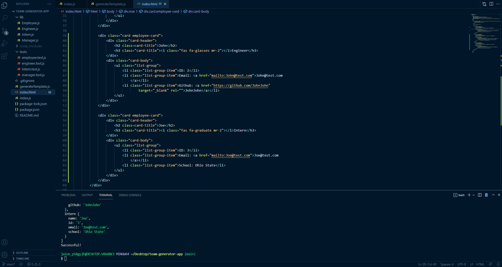

# <Your-Project-Title>
## Description
This app is useful in genertating name card for individual employees. The cards can be created for three roles within the company, and each role comes with different information included in the card.
## Table of Contents
If your README is long, add a table of contents to make it easy for users to find what they need.
- [Installation](#installation)
- [Usage](#usage)
- [Credits](#credits)
- [License](#license)
## Installation
You must run npm i inquirer for this app to run, and also npm i jest for the tests to work properly.
## Usage
The following is a gif on how the application works:
    

## Tests
There are multiple tests being ran with this app. They are using the jest download through node.js.
-To run:
-First use npm i jest in your terminal. 
-Then, use npm run test in your terminal to run the tests.
attached is a short gif demonstrating the tests:
